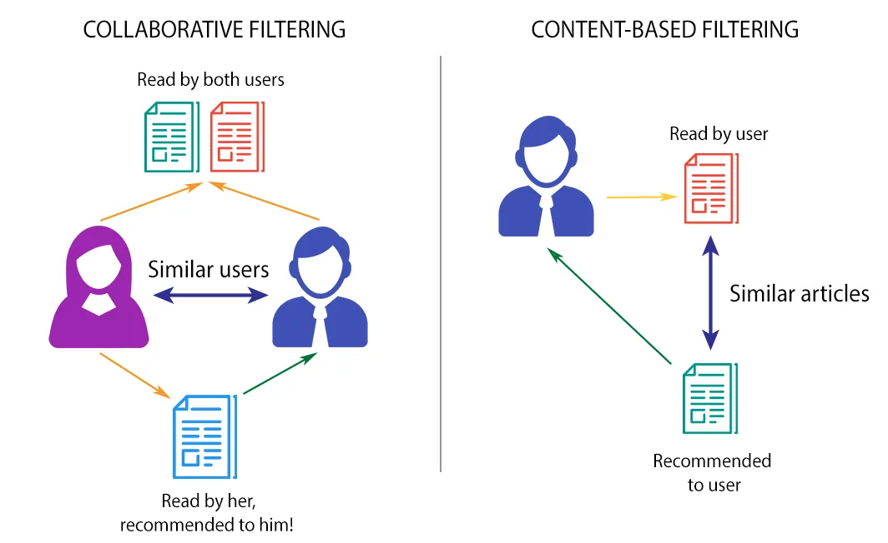

# Recommendation-System

This repository contains the implementation of **Content-Based Recommendation System** and **Collaborative Filtering Recommendation System** using a movies dataset in Python.

- Datasets link : [link](https://drive.google.com/drive/folders/1YQUi2zC2b6Bzb0SdI-NilPKReT2tA4iQ?usp=drive_link)
- a video explain Content-Based Recommended System (in arabic) : [link](https://drive.google.com/file/d/1ocgE8JgvXGcM63FUVu0ZtC4t59XrKLnh/view?usp=drive_link)
- a video explain Collaborative Filtering Recommended System (in arabic) : [link](https://drive.google.com/file/d/1IfUUziYJCpyE9XqyfKB1YHFSANisE1HW/view?usp=drive_link)

---

1. **Content-Based Recommendation:**
   - Select a test movie (e.g., "The Matrix") and run the content-based recommendation system.
   - Verify that the system outputs a list of recommended movies based on the similarity of content features.

2. **Collaborative Filtering Recommendation:**
   - Choose a test user ID (e.g., User ID = 1) and run the collaborative filtering system.
   - Check that the system suggests movies based on the preferences of similar users.
